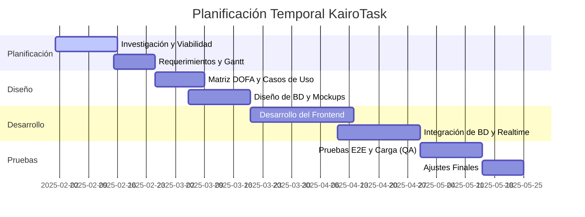
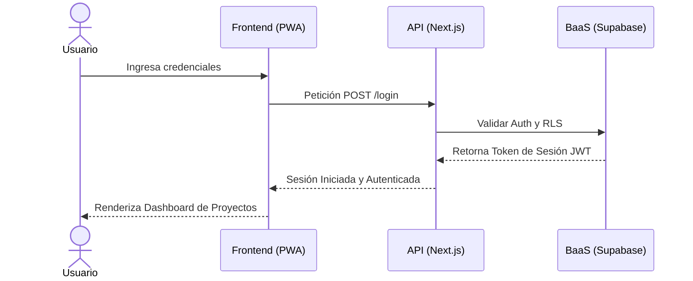
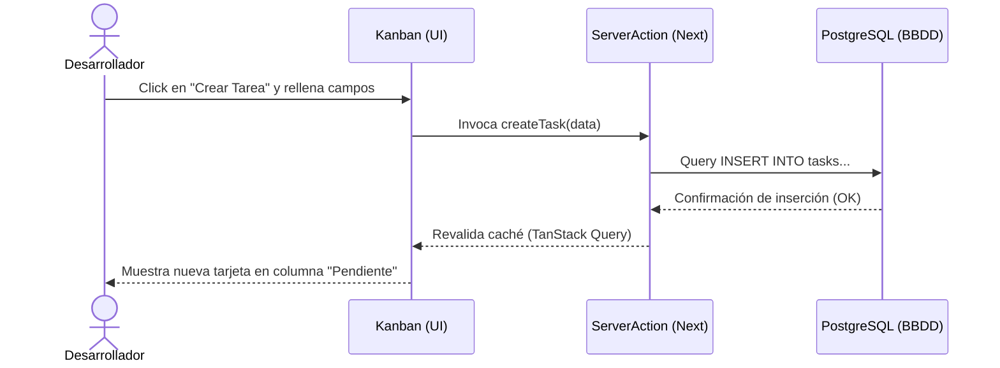

# 🏛️ Documento de Arquitectura y Especificación de Software: KairoTask

> **Plataforma Colaborativa para Gestión Ágil de Proyectos y Tareas**

---

## 👥 Datos del Proyecto

| Campo | Detalle |
| :--- | :--- |
| **Autores** | Daniel Steve Montaño   Luisa Fernanda Lucio   Didier Angulo Congo |
| **Asesor** | Daniel Bustos |
| **Institución** | Universidad del Pacífico |
| **Año** | 2025 |

---

## 📝 Resumen Ejecutivo

El presente proyecto propone el desarrollo de **KairoTask**, una plataforma colaborativa intuitiva y ágil diseñada para optimizar la gestión de proyectos y tareas en entornos universitarios o de equipos de trabajo. Actualmente, la gestión de estos proyectos a menudo es desorganizada y carece de transparencia, lo que conduce a problemas como retrasos en las entregas, comunicación deficiente entre los miembros del equipo y dificultades para monitorear el progreso real de las tareas. 

Las herramientas existentes suelen ser complejas o no se adaptan a las necesidades de equipos pequeños. **KairoTask** busca mejorar la comunicación, facilitar la asignación de responsabilidades y permitir un seguimiento preciso del progreso mediante la implementación de un sistema de notificaciones y actualizaciones en tiempo real. Este sistema fomentará una comunicación fluida y oportuna, abordando los desafíos de la gestión tradicional y proponiendo una solución tecnológica innovadora.

---

## 📖 Tabla de Contenido
1. [Introducción](#-introducción)
2. [Justificación](#-justificación)
3. [Objetivos del Proyecto](#-objetivos-del-proyecto)
   * [Objetivo General](#objetivo-general)
   * [Objetivos Específicos](#objetivos-específicos)
4. [Marco Teórico y Metodología](#-marco-teórico-y-metodología)
   * [Modelos de Proceso de Software](#modelos-de-proceso-de-software)
   * [Actividades del Proceso](#actividades-del-proceso-de-software)
   * [Gestión de Proyectos: Las 4 P](#gestión-de-proyectos-de-software-las-4-p)
5. [Planificación del Proyecto](#-planificación-del-proyecto)
   * [Diagrama de Gantt](#diagrama-de-gantt)
   * [Matriz DOFA](#matriz-dofa)
6. [Modelado del Sistema](#-modelado-del-sistema)
   * [Requerimientos Funcionales](#requerimientos-funcionales)
   * [Requerimientos No Funcionales](#requerimientos-no-funcionales)
7. [Arquitectura y Diagramas UML](#-arquitectura-y-diagramas-uml)
8. [Matriz de Riesgos del Proyecto](#-matriz-de-riesgos-del-proyecto)
9. [Referencias Bibliográficas](#-referencias-bibliográficas)

---

## 📌 Introducción

En la actualidad, tanto las instituciones académicas como los equipos de trabajo enfrentan el desafío constante de gestionar proyectos y tareas de manera eficiente y transparente. La forma tradicional o manual de gestión, o incluso el uso de herramientas poco adaptadas, a menudo resulta en desorganización, retrasos en las entregas, falta de comunicación efectiva y una visibilidad limitada del progreso de las tareas. Estos problemas no solo afectan la productividad, sino que también dificultan la colaboración y la toma de decisiones informadas.

El registro manual de asistencia, por ejemplo, es un procedimiento que consume tiempo valioso y puede generar errores, dificultando la consolidación y trazabilidad de los datos. De manera análoga, la gestión de proyectos en general sufre de problemas similares cuando no se apoya en herramientas adecuadas.

En este contexto, surge la necesidad de una solución tecnológica que modernice y optimice la gestión de proyectos y tareas. **KairoTask** se presenta como una plataforma colaborativa intuitiva y ágil diseñada para abordar estas problemáticas, promoviendo una gestión más eficiente, una comunicación mejorada y un seguimiento en tiempo real del progreso de los proyectos. Este proyecto no solo busca solucionar deficiencias operativas, sino también contribuir a la innovación tecnológica y a la mejora continua en la forma en que los equipos abordan sus tareas.

---

## 💡 Justificación

La gestión de proyectos y tareas sin una estructura o herramienta adecuada puede generar serios inconvenientes que impactan negativamente la productividad y la colaboración. La desorganización y la falta de transparencia en la asignación y seguimiento de tareas son causas directas de retrasos en las entregas y una comunicación ineficaz entre los miembros del equipo. Las herramientas existentes, que a menudo son complejas o no se adaptan a las necesidades específicas de equipos pequeños, exacerban estas dificultades.

La implementación de un sistema como **KairoTask** se justifica por la necesidad crítica de modernizar y optimizar estos procesos. Al proporcionar una plataforma colaborativa que facilita la gestión ágil, se espera reducir significativamente los inconvenientes asociados con los métodos manuales o ineficientes, tales como errores en los registros, pérdida de tiempo y dificultades en la verificación de la información. 

La solución propuesta brindará:
*   **Mayor eficiencia y precisión** en el registro y seguimiento de tareas.
*   **Transparencia mejorada**, permitiendo a todos los miembros del equipo conocer el estado y el progreso de las actividades.
*   **Comunicación fluida y oportuna** a través de notificaciones y actualizaciones en tiempo real.
*   **Asignación clara de responsabilidades**, lo que evita duplicidades y mejora la rendición de cuentas.

Este proyecto no solo ofrece una solución tecnológica innovadora, sino que también responde a las necesidades institucionales de digitalización, eficiencia y trazabilidad en los procesos de gestión de proyectos, en línea con los retos actuales de la educación superior y el trabajo en equipo. Como menciona Pressman, la gestión de proyectos de software a menudo se enfrenta a problemas de organización y cumplimiento de plazos o presupuestos, y KairoTask busca mitigar estos riesgos al ofrecer una plataforma de gestión mejorada.

---

## 🎯 Objetivos del Proyecto

### Objetivo General
Desarrollar una plataforma colaborativa intuitiva y ágil que facilite la gestión eficiente de proyectos y tareas, mejorando la comunicación, la asignación de responsabilidades y el seguimiento del progreso en equipos de trabajo.

### Objetivos Específicos
1.  **Analizar** las limitaciones y necesidades de los procesos actuales de gestión de proyectos y tareas en equipos de trabajo universitarios o similares.
2.  **Diseñar** la arquitectura del sistema KairoTask, contemplando la interfaz de usuario, la base de datos centralizada para almacenar la información de proyectos y tareas, y los módulos de colaboración y notificación.
3.  **Desarrollar** la aplicación KairoTask implementando las funcionalidades de creación, asignación, seguimiento y actualización de tareas y proyectos.
4.  **Implementar** un sistema de notificaciones y actualizaciones en tiempo real para que los miembros del equipo reciban alertas inmediatas sobre cambios, asignaciones o comentarios en las tareas.
5.  **Evaluar** la eficacia, facilidad de uso y nivel de aceptación del sistema KairoTask en un entorno de prueba controlado, a través de pruebas y retroalimentación de usuarios.

---

## 🛠️ Marco Teórico y Metodología

La ingeniería de software es una disciplina que integra el proceso, métodos y herramientas para el desarrollo de software. La gestión de proyectos de software es crucial para planificar, organizar, supervisar y controlar el desarrollo de un producto. Para KairoTask, se considerarán los siguientes aspectos:

### Modelos de Proceso de Software
Un modelo de proceso de software es un marco que define las tareas y actividades para el desarrollo de un sistema. El cronograma de KairoTask sugiere un enfoque por fases que puede ser interpretado a través de diferentes modelos de proceso:

*   **Modelo Lineal Secuencial (Cascada):** Organiza las actividades en fases secuenciales como planificación, diseño, desarrollo (código) y pruebas. Las fases de "Planificación", "Diseño", "Desarrollo y plasmación" y "Pruebas y evaluación" en el cronograma de KairoTask se alinean inicialmente con este modelo. No obstante, este modelo puede ser rígido y la retroalimentación se obtiene tarde.
*   **Modelo Incremental:** En este modelo, el software se construye en incrementos, donde cada incremento proporciona una parte funcional del producto funcional. Es de gran utilidad cuando las características completas no se conocen al inicio o para entregar funcionalidades clave rápidamente.
*   **Modelos Ágiles:** Enfatizan la adaptabilidad, la colaboración estrecha, la entrega rápida de software funcional y la respuesta inmediata al cambio. La "gestión ágil de proyectos y tareas" sugiere una afinidad con estas metodologías que priorizan la comunicación fluida y oportuna.

> [!NOTE]
> **Enfoque Metodológico de KairoTask:**
> KairoTask adopta un **modelo de proceso híbrido**, combinando la estructura por fases del modelo lineal secuencial para la planificación general, pero incorporando principios de desarrollo ágil e incremental durante las fases de diseño y desarrollo. Esto permite adaptabilidad y una entrega continua de valor, mientras se mantiene una estructura de planificación robusta.

### Actividades del Proceso de Software
Pressman identifica un conjunto de actividades paraguas que se aplican a lo largo del proceso de software y que KairoTask adopta:
1.  **Comunicación con el Cliente:** Recopilación y análisis de requisitos para entender las necesidades de los usuarios universitarios y de equipos de trabajo.
2.  **Planificación:** Establecimiento del plan de proyecto definiendo tareas, recursos y cronogramas (apoyado en un diagrama de Gantt).
3.  **Modelado (Análisis y Diseño):** 
    *   *Análisis de Requisitos:* Definición de funciones, rendimiento e interfaces del software.
    *   *Diseño:* Enfoque en cómo se construirán los componentes del software (interfaz de usuario, base de datos).
4.  **Construcción (Código y Prueba):** Generación del código limpio de Next.js y realización de pruebas E2E y unitarias con Playwright.
5.  **Despliegue:** Entrega y soporte del prototipo o software a los usuarios para su retroalimentación en entornos controlados.

---

### Gestión de Proyectos de Software: Las 4 P

#### a) Personas
Las personas son el corazón de KairoTask. Este proyecto es liderado por estudiantes de Ingeniería de Sistemas de la Universidad del Pacífico:
*   **Autores:** Daniel Steve Montaño, Luisa Fernanda Lucio y Didier Angulo Congo. Encargados del diseño, desarrollo de software, testing de QA y documentación.
*   **Asesor:** Daniel Bustos. Guía académica, técnica y metodológica del proyecto.
*   **Usuarios Finales:** Equipos de trabajo universitarios y grupos académicos que validan la usabilidad.

#### b) Proyecto
El proyecto KairoTask nace para dar respuesta a la desorganización de actividades en el ámbito académico. El cronograma organiza la planificación, el diseño, la construcción de código y las pruebas controladas en el ámbito universitario. Se orienta a demostrar que la propuesta es viable y de alta utilidad.

#### c) Producto
El producto es una plataforma colaborativa PWA intuitiva y rápida que reduce la curva de aprendizaje, facilitando:
*   Creación, edición y asignación clara de proyectos/tareas.
*   Notificaciones de alertas en tiempo real de cambios.
*   Trazabilidad de responsabilidades compartidas.

#### d) Proceso
Adopta el modelo de proceso híbrido estructurado:
*   **Planificación Temporal:** Diagrama de Gantt detallado para el seguimiento.
*   **Estimación y Métricas de Software:** Monitorización del rendimiento del sistema de notificaciones, tasa de errores de código e índices de usabilidad/satisfacción de usuario.

---

## 📅 Planificación del Proyecto

### Diagrama de Gantt
El cronograma proporciona una visión general de la secuencia y duración de las fases principales:

### Matriz DOFA

| Fortalezas (F) | Oportunidades (O) |
| :--- | :--- |
| • Enfoque colaborativo ágil y simplificado. • Integración de notificaciones en tiempo real. • Aplicación instalable (PWA). • Stack moderno y eficiente (Next.js + Supabase). | • Alta demanda de herramientas de organización en la educación superior. • Tendencia hacia la digitalización y el trabajo remoto. • Oportunidad de escalar a entornos profesionales pequeños. |
| **Debilidades (D)** | **Amenazas (A)** |
| • Limitaciones de tiempo por carga académica. • Dependencia de servicios de terceros para notificaciones y Base de Datos (BaaS). | • Alta competencia con herramientas corporativas consolidadas (Jira, Trello, Asana). • Resistencia al cambio y baja adopción de nuevas herramientas. |

---

## ⚙️ Modelado del Sistema

### Requerimientos Funcionales

| Código | Descripción del Requerimiento Funcional |
| :--- | :--- |
| **RF 1.1** | El sistema debe permitir el registro de usuario con verificación de correo. |
| **RF 1.2** | El sistema debe permitir iniciar sesión. |
| **RF 1.3** | El sistema debe permitir cerrar sesión. |
| **RF 1.4** | El sistema debe permitir recuperar la contraseña por medio del correo registrado. |
| **RF 1.5** | El sistema debe permitir crear proyectos. |
| **RF 1.6** | El sistema debe permitir editar proyectos. |
| **RF 1.7** | El sistema debe permitir archivar proyectos. |
| **RF 1.8** | El sistema debe permitir crear tareas. |
| **RF 1.9** | El sistema debe permitir editar tareas. |
| **RF 1.10** | El sistema debe permitir archivar tareas. |
| **RF 1.11** | El sistema debe permitir asignar tareas a miembros de un proyecto o tarea. |
| **RF 1.12** | El sistema debe permitir editar la asignación de tareas a miembros de un proyecto o tarea. |
| **RF 1.13** | El sistema debe permitir actualizar el estado de un proyecto o tarea. |
| **RF 1.14** | El sistema debe permitir comentar los proyectos o tareas. |
| **RF 1.15** | El sistema debe permitir invitar a nuevos miembros al equipo de trabajo de un proyecto o tarea. |
| **RF 1.16** | El sistema debe permitir asignar una fecha límite de entrega. |
| **RF 1.17** | El sistema debe notificar a los miembros de un proyecto o tarea cuando se genere algún cambio o novedad. |

---

### Requerimientos No Funcionales

#### 📊 Rendimiento y Concurrencia
*   **RNF 2.1.1:** El sistema debe soportar hasta **50,000 usuarios concurrentes** sin degradar significativamente sus tiempos de respuesta.

#### 🔒 Seguridad, Compatibilidad e Integridad
*   **RNF 2.2.1:** El sistema debe cumplir con los estándares de seguridad vigentes para la protección de datos personales.
*   **RNF 2.2.2:** El diseño debe ser compatible con los navegadores web de escritorio y móviles más utilizados (Chrome, Firefox, Safari, Edge).
*   **RNF 2.2.3:** El diseño de la base de datos debe garantizar la integridad y consistencia de los datos, permitiendo actualizaciones y consultas de forma eficiente.
*   **RNF 2.2.4:** La interfaz de usuario debe ser responsiva y fluida, adaptándose automáticamente a computadoras, tablets y smartphones (Responsive Design).

#### 🛡️ Atributos del Sistema y Disponibilidad
*   **RNF 2.3.1:** El sistema debe ser confiable y asegurar una disponibilidad del **99.9%**, minimizando los tiempos de inactividad no planificados.
*   **RNF 2.3.2:** Solo usuarios autorizados (preferiblemente con correos institucionales) tendrán acceso al sistema.
*   **RNF 2.3.3:** El sistema debe garantizar la seguridad de los datos mediante el cifrado de las comunicaciones (HTTPS/WSS) y de los datos sensibles almacenados.
*   **RNF 2.3.4:** El sistema debe supervisar, analizar y registrar de manera detallada las actividades que los usuarios realizan dentro del sistema para garantizar la trazabilidad de los procesos esenciales (creación de tareas, cambios de estados, asignaciones).
*   **RNF 2.3.5:** El software debe cumplir con las normativas legales de protección de datos personales de la legislación vigente, garantizando la privacidad e intimidad de la información.

---

## 🎨 Arquitectura y Diagramas UML

A nivel de arquitectura lógica y flujo de datos, KairoTask utiliza los siguientes diagramas conceptuales:

### Diagrama de Flujo Lógico (Inicio de Sesión y Acciones)

### Flujo de Creación de Tareas

---

## ⚠️ Matriz de Riesgos del Proyecto

El siguiente cuadro presenta los principales riesgos identificados durante el desarrollo del proyecto **KairoTask**, evaluando su probabilidad, impacto, severidad y respectivas estrategias de mitigación:

| Riesgo Identificado | Descripción | Probabilidad | Impacto | Severidad | Medidas Preventivas o de Mitigación |
| :--- | :--- | :---: | :---: | :---: | :--- |
| **Retraso en la entrega** | Incumplimiento de fechas debido a alta carga académica. | Alta | Alta | **Alto** | Establecer cronogramas realistas, reuniones semanales de seguimiento y control con el diagrama de Gantt. |
| **Fallas técnicas en desarrollo** | Problemas de compatibilidad o errores críticos en el código. | Media | Alta | **Medio-Alto** | Realizar pruebas periódicas, respaldar el código diariamente en GitHub (Git branch protection) y poseer planes de contingencia. |
| **Comunicación deficiente** | Dificultad para coordinar actividades o mantener actualizados a los integrantes. | Media | Media | **Medio** | Usar canales claros de comunicación (WhatsApp, notificaciones del sistema) y asignar roles precisos. |
| **Pérdida de datos** | Riesgo de perder avances de código o registros de la base de datos. | Baja | Alta | **Medio** | Implementar copias de seguridad automáticas en la nube de Supabase y control estricto de Git. |
| **Fallo en notificaciones** | Inestabilidad en las alertas dinámicas en tiempo real. | Media | Media | **Medio** | Realizar pruebas unitarias y de integración de sockets y WebSockets antes del despliegue. |
| **Falta de cumplimiento** | No implementar la totalidad de los requerimientos funcionales aprobados. | Media | Alta | **Medio-Alto** | Revisar continuamente la matriz de trazabilidad de requerimientos en cada sprint. |
| **Vulnerabilidades de seguridad** | Acceso no autorizado o fuga de datos sensibles. | Baja | Alta | **Medio** | Aplicar Row Level Security (RLS) en Supabase, cifrado de conexiones y autenticación segura con tokens JWT. |
| **Baja retroalimentación** | No recopilar datos suficientes de usuarios reales durante las pruebas. | Media | Media | **Medio** | Diseñar pruebas piloto de usabilidad obligatorias con compañeros de clase antes de la evaluación final. |

---

## 📚 Referencias Bibliográficas

*   **Pressman, R. S.** *Ingeniería del Software: Un Enfoque Práctico* (Edición 5). McGraw-Hill.
*   **Asana.** (2023). *Asana Work Management Platform*. Recuperado de [asana.com](https://asana.com)
*   **Atlassian.** (2023). *Trello & Jira Software*. Recuperado de [atlassian.com](https://www.atlassian.com)
*   **Monday.com.** (2023). *Monday.com Work OS*. Recuperado de [monday.com](https://monday.com)
*   **Microsoft.** (2023). *Microsoft Project*. Recuperado de [microsoft.com](https://www.microsoft.com)
