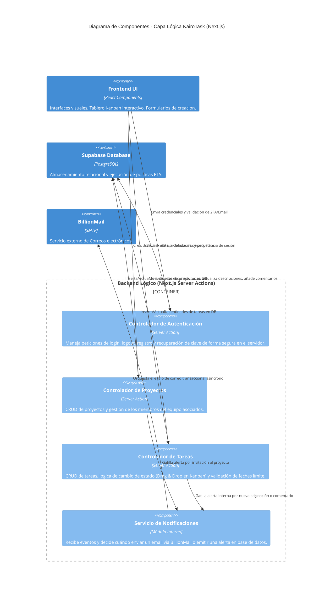

# Nivel 3: Diagrama de Componentes (Backend / Server Actions)

Este diagrama se enfoca en la capa interna de la aplicación (Next.js), detallando los módulos lógicos (Server Actions y Controladores) que permiten el funcionamiento orquestado de **KairoTask**.

## Descripción de Componentes Internos

*   **Controlador de Autenticación:** Se comunica con la API de Supabase Auth para gestionar los tokens JWT (que luego son configurados para ser almacenados en cookies HTTP-only). Protege las rutas principales de la PWA redirigiendo a los usuarios no autenticados mediante Next.js Middleware.
*   **Controlador de Proyectos:** Contiene la lógica de negocio para crear espacios de trabajo. Verifica límites de proyectos (si los hubiere) y gestiona la tabla de relación (usuario-proyecto) para dar los accesos correctos a los compañeros de equipo invitados.
*   **Controlador de Tareas:** Es el módulo de mayor uso. Cada vez que un usuario arrastra una tarea en el Kanban o cambia su nivel de prioridad, esta Server Action se ejecuta, valida los roles de usuario a través de RLS, y actualiza la fila correspondiente en la base de datos PostgreSQL, retornando la versión actualizada para revalidar el caché del frontend.
*   **Servicio de Notificaciones:** Un servicio interno que intercepta acciones importantes provenientes de los controladores (ej: asignar a un estudiante a una tarea urgente o acercarse a una fecha de entrega) para gestionar el envío del correo electrónico con BillionMail y registrar la notificación in-app en la base de datos para que Supabase Realtime la distribuya a la campana de alertas del usuario.
