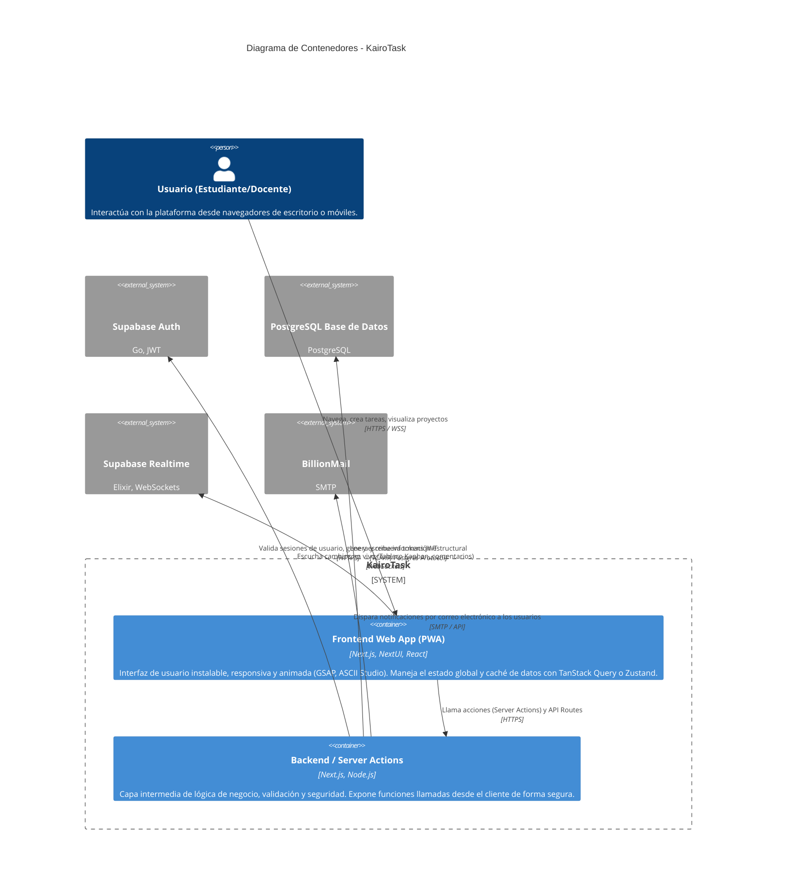

# Nivel 2: Diagrama de Contenedores

Este diagrama desglosa el Sistema **KairoTask** en sus contenedores principales de ejecución y almacenamiento, mostrando cómo están distribuidas las responsabilidades tecnológicas.

## Descripción de Contenedores

1.  **Frontend Web App (PWA):** Construido sobre React y el App Router de Next.js. Provee una experiencia inmersiva usando NextUI para la base de componentes, GSAP para animaciones complejas y ASCII Studio para identidad visual. Integra Service Workers a través de `@ducanh2912/next-pwa` para funcionalidad offline parcial y la capacidad de instalarse como una aplicación en móviles o escritorio.
2.  **Backend / Server Actions:** Aprovechando las capacidades de Next.js, se elimina la necesidad de un servidor Node.js (como Express) separado. Las Server Actions actúan como controladores backend seguros que procesan formularios y peticiones en el lado del servidor antes de interactuar con la base de datos o APIs externas.
3.  **Supabase Auth & DB & Realtime:** Supabase se divide conceptualmente en tres servicios altamente acoplados que son consumidos por KairoTask.
    *   **Auth:** Gestiona las identidades (Registro, Login, Recuperación). Los tokens se guardan de forma segura en cookies.
    *   **PostgreSQL:** El corazón de los datos. Emplea RLS (Row Level Security) para garantizar que un estudiante solo pueda ver y modificar los proyectos y tareas a los que pertenece o le han sido asignados.
    *   **Realtime:** Esencial para la actualización instantánea del tablero Kanban; cuando un compañero mueve una tarea de columna, el cambio se refleja en milisegundos en la pantalla del resto del equipo.
