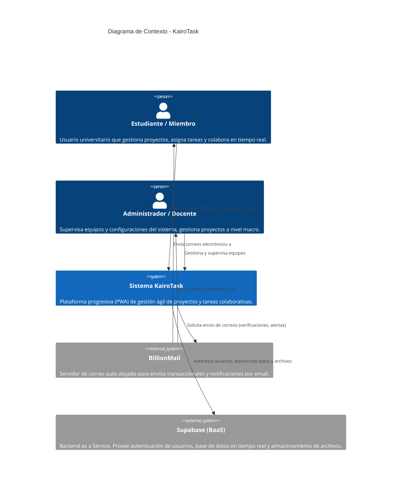

# Nivel 1: Diagrama de Contexto (Vista General)

Este diagrama modela la relación de **KairoTask** con sus usuarios y sistemas externos de nivel macro, detallando cómo interactúan los diferentes actores con la plataforma y qué dependencias externas existen.

## Descripción de Componentes

### Actores
*   **Estudiante / Miembro:** Es el usuario final principal. Utiliza KairoTask para crear proyectos, definir tareas, actualizar estados (Kanban) y comunicarse con su equipo.
*   **Administrador / Docente:** Un usuario con permisos elevados que puede administrar configuraciones del sistema, supervisar varios equipos de estudiantes y auditar la actividad de los proyectos.

### Sistemas
*   **Sistema KairoTask:** La aplicación principal desarrollada en Next.js. Funciona como una PWA (Progressive Web App) para asegurar accesibilidad multiplataforma y una experiencia similar a una app nativa.
*   **Supabase (BaaS):** Servicio de infraestructura gestionada que actúa como pilar fundamental de los datos. Proporciona la base de datos PostgreSQL, la autenticación y las capacidades en tiempo real (WebSockets).
*   **BillionMail:** Sistema externo encargado de la entrega de correos electrónicos transaccionales, vital para el proceso de registro (confirmación de cuenta), recuperación de contraseñas y alertas críticas.
