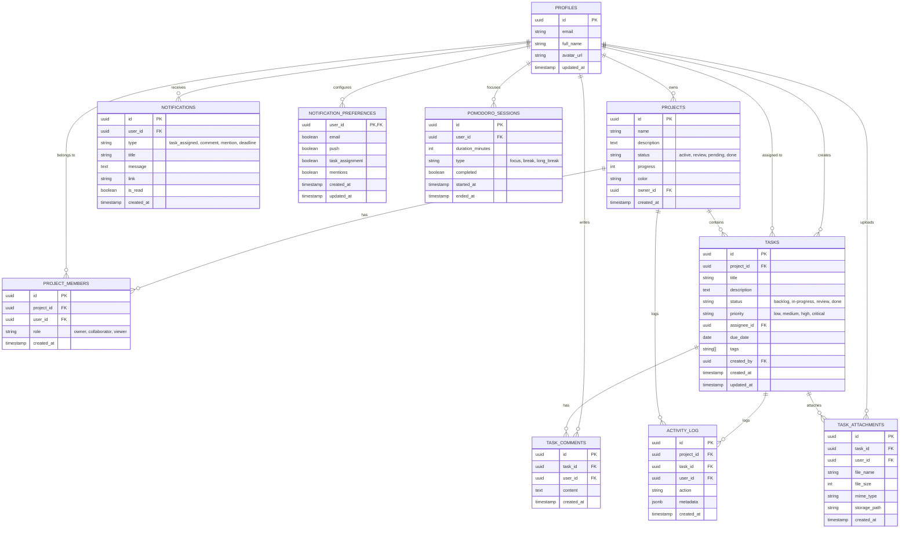

# Diagrama Entidad-Relación (Base de Datos)

El corazón de los datos de **KairoTask** reside en una base de datos PostgreSQL alojada en **Supabase**. Actualmente hay **7 migraciones** que definen 10 tablas y 2 buckets de Storage.

## Entidades

| Tabla | Propósito | Migración |
|-------|-----------|-----------|
| `profiles` | Perfiles sincronizados desde auth.users vía trigger | 003 |
| `projects` | Proyectos con estado, progreso y color | 001 |
| `project_members` | Relación usuario-proyecto con roles | 003 |
| `tasks` | Tareas con status, prioridad, tags y fechas | 002 |
| `task_comments` | Comentarios en tareas | 004 |
| `activity_log` | Log automático de actividad vía trigger | 004 |
| `notifications` | Notificaciones con tipos y link | 006 |
| `notification_preferences` | Preferencias de notificación por usuario | 006 |
| `pomodoro_sessions` | Sesiones de enfoque/descanso | 005 |
| `task_attachments` | Archivos adjuntos a tareas | 007 |

## Storage Buckets

| Bucket | Visibilidad | Límite | Tipos | Propósito |
|--------|-------------|--------|-------|-----------|
| `avatars` | Público | 2 MB | Imágenes | Fotos de perfil |
| `task-attachments` | Privado | 10 MB | Cualquiera | Archivos de tareas (vía signed URLs) |

## Seguridad (RLS)

Todas las tablas tienen Row Level Security habilitado. Políticas clave:

- **projects/**: owner ve todos sus proyectos; miembros ven proyectos compartidos vía project_members
- **tasks/**: miembros del proyecto pueden CRUD tareas según su rol
- **project_members/**: owner puede gestionar miembros; cada quien ve sus membresías
- **task_attachments/**: miembros del proyecto pueden ver/crear; creador puede eliminar
- **storage.objects**: avatars son públicos; task-attachments requiere membresía al proyecto

## Realtime

Las siguientes tablas están publicadas en `supabase_realtime`:
`tasks`, `project_members`, `task_comments`, `activity_log`, `notifications`, `task_attachments`
