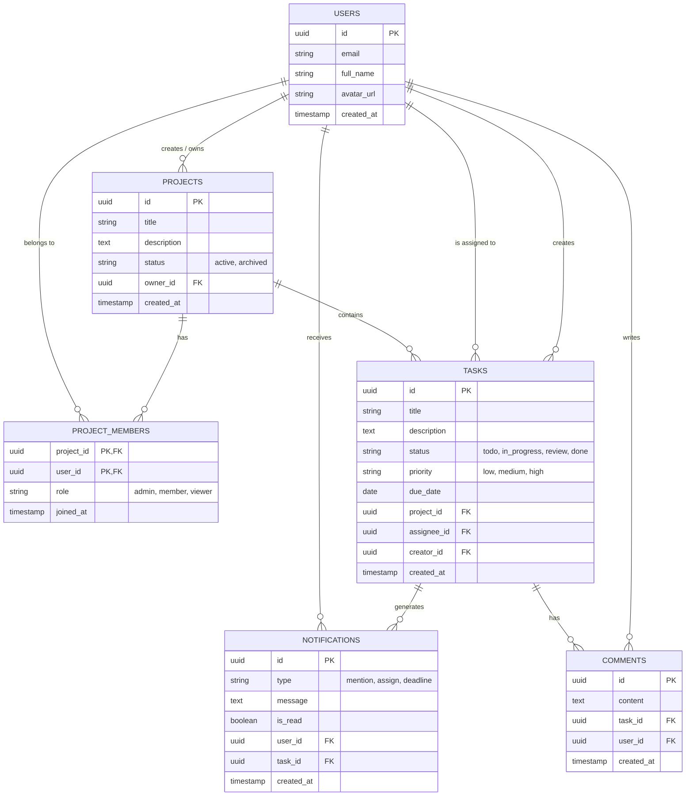

# Diagrama Entidad-Relación (Base de Datos)

El corazón de los datos de **KairoTask** reside en una base de datos PostgreSQL alojada en **Supabase**. Este modelo de datos garantiza la integridad relacional para la estructura de proyectos, las tareas colaborativas y el manejo granular de los miembros del equipo.

## Descripción de Entidades

*   **USERS (Usuarios):** La gestión primaria de la cuenta se maneja a través de Supabase Auth, pero esta entidad representa la tabla pública `users` (perfiles) que se sincroniza automáticamente vía Triggers, almacenando información como nombre y foto de perfil.
*   **PROJECTS (Proyectos):** Cada proyecto tiene un usuario propietario o creador principal (`owner_id`) y un estado (`status`) para poder ocultar proyectos archivados de la vista diaria. Agrupa lógicamente un conjunto de tareas.
*   **PROJECT_MEMBERS (Miembros de Proyecto):** Esta es la tabla pivote que resuelve la relación muchos-a-muchos entre usuarios y proyectos. Es fundamental, ya que permite compartir un proyecto con todo un equipo universitario, definiendo roles (ej. un "viewer" solo lee, un "member" puede mover tareas, y un "admin" puede invitar más gente).
*   **TASKS (Tareas):** El elemento central de valor de la plataforma, que se gestiona visualmente a través del Kanban. Contiene estados que reflejan directamente las columnas del tablero (`todo`, `in_progress`, `review`, `done`), prioridades para ordenamiento, y fechas límite (`due_date`). Está vinculada tanto a quién la creó como a quién debe ejecutarla (`assignee_id`).
*   **COMMENTS (Comentarios):** Permite la comunicación asíncrona dentro de cada tarea. Mejora la trazabilidad de las discusiones o dudas sobre una asignación, evitando que la comunicación se fragmente en WhatsApp u otras herramientas.
*   **NOTIFICATIONS (Notificaciones):** El registro de eventos generados por el sistema (alguien te mencionó, te asignaron una tarea, o tu tarea vence mañana) que alimenta la campanita de la UI, facilitando un consumo posterior si el usuario no estaba conectado a través del sistema Realtime.

### Seguridad a Nivel de Filas (Row Level Security - RLS)

En Supabase, al interactuar directamente la PWA mediante ciertas API públicas, cada tabla de este modelo estará protegida en el servidor de Base de Datos por estrictas políticas RLS. 
Ejemplos de estas políticas incluyen:
1.  **Lectura:** Un usuario autenticado solo puede obtener (SELECT) información de la tabla `PROJECTS` si el `id` del proyecto coincide con un registro en `PROJECT_MEMBERS` donde figura su propio `user_id`.
2.  **Escritura:** Un usuario solo puede actualizar (UPDATE) el estado de una fila en la tabla `TASKS` si tiene un rol de `admin` o `member` en el proyecto padre, asegurando total control de acceso.
